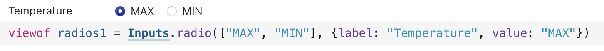

# Hong Kong Temperature Visualization

## Overview
This project visualizes daily temperature data for Hong Kong using D3.js on Observable. The visualization consists of two levels of complexity:
1. A Year/Month Heatmap showing monthly temperature patterns across years
2. An enhanced version that includes daily temperature variations within each month-year cell

Observable project link: **[https://observablehq.com/@shashank4/shashank-csce-679-assignment-2](https://observablehq.com/@shashank4/shashank-csce-679-assignment-2)**.

Observable project code: `shashank-csce-679-assignment-2.zip` (Uploaded to this github repository)

# Hong Kong Temperature Visualization

## Overview
This project visualizes daily temperature data for Hong Kong using D3.js on Observable. The visualization consists of two levels of complexity:
1. A Year/Month Heatmap showing monthly temperature patterns across years
2. An enhanced version that includes daily temperature variations within each month-year cell

## Data
The visualization uses `temperature_daily.csv`, which contains daily temperature records for Hong Kong over multiple years.

*Figure 1: Sample of the temperature data in tabular format*

## Level 1: Year/Month Heatmap
This visualization presents a matrix view where:
- X-axis represents years
- Y-axis represents months
- Each cell is colored according to the temperature value for that month-year combination

### Features
- Toggle between maximum and minimum temperature views
- Hover tooltips showing date and exact temperature values
- Color legend indicating the temperature scale
- Clear visual pattern of seasonal temperature changes across years

### Interaction
- Click the buttons to switch between maximum and minimum temperature views
- Hover over any cell to see detailed information

*Figure 2: Toggle Button (currently Maximum selected)*

*Figure 3: Level 1 visualization showing maximum temperatures by month and year*

*Figure 4: Level 1 visualization showing minimum temperatures by month and year*

## Level 2: Enhanced Heatmap with Daily Temperature Variations
This advanced visualization builds on Level 1 by adding:
- Mini line charts inside each month-year cell showing daily temperature fluctuations
- Focus on the 2008 to 2017 years for better readability
- Preservation of the color-coding system from Level 1

### Features
- All Level 1 features plus:
- Daily temperature trends visible within each month
- Ability to identify extreme temperature days within months
- Clearer visualization of weather patterns and anomalies

### Implementation Details
- Each cell contains a small multiples chart showing day-by-day temperature changes
- X-axis of mini-charts represents days (1-31)
- Y-axis of mini-charts represents temperature values
- Consistent color scheme throughout for easy interpretation

*Figure 5: Level 2 visualization showing daily maximum temperature variations within each month-year cell*

*Figure 6: Level 2 visualization showing daily minimum temperature variations within each month-year cell*

## Usage Instructions
1. Visit the Observable notebook at the provided URL
2. The default view shows the Level 1 heatmap with maximum temperatures
3. Use the toggle buttons to switch between viewing maximum and minimum temperatures
4. Hover over cells to see specific temperature information
5. Scroll down to view the Level 2 visualization with daily temperature variations
6. The color legend helps interpret temperature values across all visualizations

## Technical Implementation
The visualization is built using:
- D3.js for data binding and visualization
- Observable's reactive notebook environment
- SVG for rendering the heatmaps and line charts
- JavaScript for interaction handling

## Analysis of Hong Kong Temperature Visualization
The provided visualizations offer a comprehensive view of temperature trends in Hong Kong, utilizing both monthly and daily data across multiple years. Below is an analysis based on the images and project description:

### Level 1: Year/Month Heatmap
This heatmap provides an overview of monthly temperature patterns over several years. Key observations include:
1. Seasonal Trends:
  - The heatmaps clearly show seasonal variations, with cooler temperatures in January and February (winter months) and warmer temperatures in July and August (summer months).
  - The color gradients (yellow to red) effectively represent the temperature spectrum, highlighting the hottest months.
2. Year-to-Year Comparisons:
  - Maximum temperatures (Figure 3) consistently peak during summer months, with August showing the highest values across most years.
  - Minimum temperatures (Figure 4) reflect colder periods during winter months, with noticeable dips in January and February.
3. Anomalies:
  - Certain years, such as 2016, show unusual temperature drops or spikes, which might indicate extreme weather events or anomalies.
4. Interactive Features:
  - The ability to toggle between maximum and minimum temperature views allows users to explore both extremes of the data effectively.
  - Hover tooltips provide precise values for specific month-year combinations, enhancing usability.

### Level 2: Enhanced Heatmap with Daily Variations
This visualization adds granularity by incorporating daily temperature fluctuations within each month-year cell. Observations include:
1. Daily Temperature Trends:
  - Mini line charts within each cell reveal day-to-day temperature changes, offering insights into intra-month variability.
  - For example, April 2012 shows minimum temperatures around 19°C and maximum temperatures around 31°C (Figures 1 and 2).
2. Extreme Temperature Days:
  - The line charts help identify specific days with unusually high or low temperatures within a given month.
  - This feature is particularly useful for analyzing short-term weather events.
3. Focus on Specific Years:
  - By narrowing the dataset to 2008–2017, the visualization avoids clutter and provides a clearer view of recent trends.
4. Color Coding Consistency:
  - The consistent use of color gradients ensures easy interpretation across both levels of visualization.

### Insights from the Visualizations
1. Seasonal Patterns:
  - Hong Kong experiences predictable seasonal temperature shifts, with summers being consistently hot and winters cool.
2. Climate Change Indicators:
  - Year-to-year trends may suggest gradual warming or increased variability in temperatures over time.
  - Anomalies such as sharp dips or spikes could be linked to global climate phenomena.
3. Temperature Volatility:
  - Daily variations within months highlight the dynamic nature of Hong Kong's weather, especially during transitional seasons like spring and autumn.
4. User-Friendly Design:
  - The interactive features and visual clarity make this visualization accessible to both researchers and casual users interested in Hong Kong's climate data.

## Conclusion
The combination of Level 1 and Level 2 visualizations provides a robust tool for analyzing Hong Kong's temperature data. Seasonal trends, anomalies, and daily fluctuations are all effectively captured, making this project a valuable resource for understanding local climate patterns over time.

